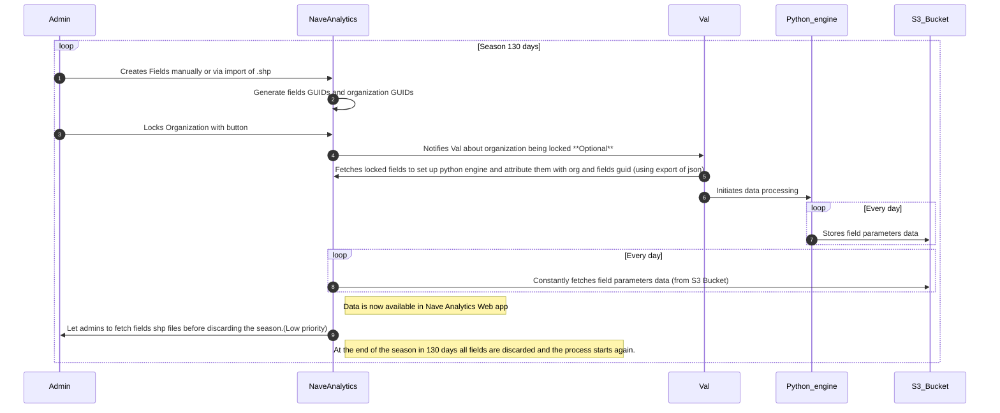

```mermaid
sequenceDiagram
    autonumber
    loop Season 130 days
        Admin ->> NaveAnalytics: Creates Fields manually or via import of .shp
        NaveAnalytics ->> NaveAnalytics: Generate fields GUIDs and organization GUIDs
        Admin ->> NaveAnalytics: Locks Organization with button
        NaveAnalytics ->> Val: Notifies Val about organization being locked **Optional**
        Val ->> NaveAnalytics: Fetches locked fields to set up python engine and attribute them with org and fields guid (using export of json)
        Val ->> Python_engine: Initiates data processing
        loop Every day
            Python_engine ->> S3_Bucket: Stores field parameters data
        end

        loop Every day
            NaveAnalytics ->> S3_Bucket: Constantly fetches field parameters data (from S3 Bucket)
        end
        Note right of NaveAnalytics: Data is now available in Nave Analytics Web app
        NaveAnalytics ->> Admin: Let admins to fetch fields shp files before discarding the season.(Low priority)
        Note right of NaveAnalytics: At the end of the season in 130 days all fields are discarded and the process starts again.

    end
```
